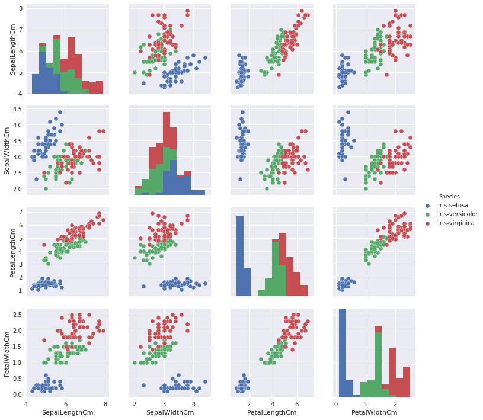
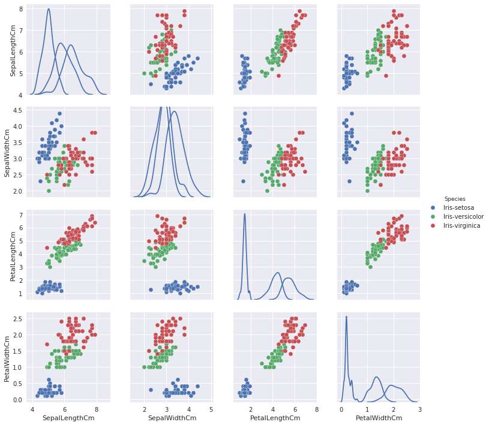

---

---

<strong>IRIS Data Set Analysis Using Python.</strong> 
<strong>About the Dataset.</strong> 
The Iris flower data set or Fisher’s Iris data set is a multivariate data set introduced by the British statistician and biologist Ronald Fisher in his 1936 paper, The use of multiple measurements in taxonomic problems, as an example of linear discriminant analysis. 
The Dataset consist of three iris species with 50 samples each as well as some properties about each flower. One flower species is linearly separable from the other two, but the other two are not linearly separable from each other. 
The columns in this dataset are: 
Id 
SepalLengthCm 
SepalWidthCm 
PetalLengthCm 
PetalWidthCm 
Species 

Below Libraries are used

<pre class=" language-python"><code class="prism  language-python"># Importing the libraries
import numpy as np
import seaborn as sns
import matplotlib.pyplot as plt
sns.set(color_codes=True)
import pandas as pd
%matplotlib inline

</code></pre>

Importing the Iris.csv file using Panda Library. First Five rows are displayed using dataset.head command.

<pre class=" language-python"><code class="prism  language-python"># Importing the dataset
dataset = pd.read_csv('Iris.csv')
dataset.head()

</code></pre>

<table class="dataframe">
  <thead>
    <tr>
      <th></th>
      <th>Id</th>
      <th>SepalLengthCm</th>
      <th>SepalWidthCm</th>
      <th>PetalLengthCm</th>
      <th>PetalWidthCm</th>
      <th>Species</th>
    </tr>
  </thead>
  <tbody>
    <tr>
      <th>0</th>
      <td>1</td>
      <td>5.1</td>
      <td>3.5</td>
      <td>1.4</td>
      <td>0.2</td>
      <td>Iris-setosa</td>
    </tr>
    <tr>
      <th>1</th>
      <td>2</td>
      <td>4.9</td>
      <td>3.0</td>
      <td>1.4</td>
      <td>0.2</td>
      <td>Iris-setosa</td>
    </tr>
    <tr>
      <th>2</th>
      <td>3</td>
      <td>4.7</td>
      <td>3.2</td>
      <td>1.3</td>
      <td>0.2</td>
      <td>Iris-setosa</td>
    </tr>
    <tr>
      <th>3</th>
      <td>4</td>
      <td>4.6</td>
      <td>3.1</td>
      <td>1.5</td>
      <td>0.2</td>
      <td>Iris-setosa</td>
    </tr>
    <tr>
      <th>4</th>
      <td>5</td>
      <td>5.0</td>
      <td>3.6</td>
      <td>1.4</td>
      <td>0.2</td>
      <td>Iris-setosa</td>
    </tr>
  </tbody>
</table>

Below command will display number of Rows and Columns in the Table.

<pre class=" language-python"><code class="prism  language-python"># shape Of the Data Set
print(dataset.shape)

</code></pre>
<pre><code>(150, 6)
</code></pre>

Determining Minimum , Maximum, Mean , Median and Standard Deviation …

<pre class=" language-python"><code class="prism  language-python"># Determining Minimum Value of each Column.
dataset.min()
</code></pre>
<pre><code>Id                         1
SepalLengthCm            4.3
SepalWidthCm               2
PetalLengthCm              1
PetalWidthCm             0.1
Species          Iris-setosa
dtype: object
</code></pre>
<pre class=" language-python"><code class="prism  language-python"># Determining Maximum Value of each Column.
dataset.max()
</code></pre>
<pre><code>Id                          150
SepalLengthCm               7.9
SepalWidthCm                4.4
PetalLengthCm               6.9
PetalWidthCm                2.5
Species          Iris-virginica
dtype: object
</code></pre>
<pre class=" language-python"><code class="prism  language-python"># Determining Mean Value of each Column.
dataset.mean()
</code></pre>
<pre><code>Id               75.500000
SepalLengthCm     5.843333
SepalWidthCm      3.054000
PetalLengthCm     3.758667
PetalWidthCm      1.198667
dtype: float64
</code></pre>
<pre class=" language-python"><code class="prism  language-python"># Determining Median Value of each Column.
dataset.median()
</code></pre>
<pre><code>Id               75.50
SepalLengthCm     5.80
SepalWidthCm      3.00
PetalLengthCm     4.35
PetalWidthCm      1.30
dtype: float64
</code></pre>
<pre class=" language-python"><code class="prism  language-python"># Determining Standard Deviation of each Column.
dataset.std()
</code></pre>
<pre><code>Id               43.445368
SepalLengthCm     0.828066
SepalWidthCm      0.433594
PetalLengthCm     1.764420
PetalWidthCm      0.763161
dtype: float64
</code></pre>

Dropping the ID Column since there is no significance of this column.

<pre class=" language-python"><code class="prism  language-python">#drop Id column
dataset = dataset.drop('Id',axis=1)
dataset.head()

</code></pre>

<table class="dataframe">
  <thead>
    <tr>
      <th></th>
      <th>SepalLengthCm</th>
      <th>SepalWidthCm</th>
      <th>PetalLengthCm</th>
      <th>PetalWidthCm</th>
      <th>Species</th>
    </tr>
  </thead>
  <tbody>
    <tr>
      <th>0</th>
      <td>5.1</td>
      <td>3.5</td>
      <td>1.4</td>
      <td>0.2</td>
      <td>Iris-setosa</td>
    </tr>
    <tr>
      <th>1</th>
      <td>4.9</td>
      <td>3.0</td>
      <td>1.4</td>
      <td>0.2</td>
      <td>Iris-setosa</td>
    </tr>
    <tr>
      <th>2</th>
      <td>4.7</td>
      <td>3.2</td>
      <td>1.3</td>
      <td>0.2</td>
      <td>Iris-setosa</td>
    </tr>
    <tr>
      <th>3</th>
      <td>4.6</td>
      <td>3.1</td>
      <td>1.5</td>
      <td>0.2</td>
      <td>Iris-setosa</td>
    </tr>
    <tr>
      <th>4</th>
      <td>5.0</td>
      <td>3.6</td>
      <td>1.4</td>
      <td>0.2</td>
      <td>Iris-setosa</td>
    </tr>
  </tbody>
</table>

Displaying additional information.

<pre class=" language-python"><code class="prism  language-python"># more info on the data
print(dataset.info())

</code></pre>
<pre><code>&lt;class 'pandas.core.frame.DataFrame'&gt;
RangeIndex: 150 entries, 0 to 149
Data columns (total 5 columns):
SepalLengthCm    150 non-null float64
SepalWidthCm     150 non-null float64
PetalLengthCm    150 non-null float64
PetalWidthCm     150 non-null float64
Species          150 non-null object
dtypes: float64(4), object(1)
memory usage: 5.9+ KB
None
</code></pre>
<pre class=" language-python"><code class="prism  language-python"># descriptions
print(dataset.describe())

</code></pre>
<pre><code>       SepalLengthCm  SepalWidthCm  PetalLengthCm  PetalWidthCm
count     150.000000    150.000000     150.000000    150.000000
mean        5.843333      3.054000       3.758667      1.198667
std         0.828066      0.433594       1.764420      0.763161
min         4.300000      2.000000       1.000000      0.100000
25%         5.100000      2.800000       1.600000      0.300000
50%         5.800000      3.000000       4.350000      1.300000
75%         6.400000      3.300000       5.100000      1.800000
max         7.900000      4.400000       6.900000      2.500000
</code></pre>
<pre class=" language-python"><code class="prism  language-python"># class distribution
print(dataset.groupby('Species').size())

</code></pre>
<pre><code>Species
Iris-setosa        50
Iris-versicolor    50
Iris-virginica     50
dtype: int64
</code></pre>

Displaying the details by using Box and Whisker Plots

<pre class=" language-python"><code class="prism  language-python"># box and whisker plots
dataset.plot(kind='box', sharex=False, sharey=False)

</code></pre>
<pre><code>&lt;matplotlib.axes._subplots.AxesSubplot at 0x7f9bb3e88198&gt;
</code></pre>

Histogram Pictorial presentation of the data set.

<pre class=" language-python"><code class="prism  language-python"># histograms
dataset.hist(edgecolor='black', linewidth=1.2)

</code></pre>
<pre><code>array([[&lt;matplotlib.axes._subplots.AxesSubplot object at 0x7f9bb3bee320&gt;,
        &lt;matplotlib.axes._subplots.AxesSubplot object at 0x7f9bb3bbe358&gt;],
       [&lt;matplotlib.axes._subplots.AxesSubplot object at 0x7f9bb3b60518&gt;,
        &lt;matplotlib.axes._subplots.AxesSubplot object at 0x7f9bb3b04668&gt;]],
      dtype=object)
</code></pre>

boxplot on each feature split out by species

<pre class=" language-python"><code class="prism  language-python"># boxplot on each feature split out by species
dataset.boxplot(by="Species",figsize=(10,10))

</code></pre>
<pre><code>array([[&lt;matplotlib.axes._subplots.AxesSubplot object at 0x7f9bb3a94160&gt;,
        &lt;matplotlib.axes._subplots.AxesSubplot object at 0x7f9bb3abcd68&gt;],
       [&lt;matplotlib.axes._subplots.AxesSubplot object at 0x7f9bb3a65048&gt;,
        &lt;matplotlib.axes._subplots.AxesSubplot object at 0x7f9bb37c62e8&gt;]],
      dtype=object)
</code></pre>

violin plots on petal-length for each species

<pre class=" language-python"><code class="prism  language-python"># violinplots on petal-length for each species
sns.violinplot(data=dataset,x="Species", y="PetalLengthCm")

</code></pre>
<pre><code>/home/nbuser/anaconda3_420/lib/python3.5/site-packages/scipy/stats/stats.py:1713: FutureWarning: Using a non-tuple sequence for multidimensional indexing is deprecated; use `arr[tuple(seq)]` instead of `arr[seq]`. In the future this will be interpreted as an array index, `arr[np.array(seq)]`, which will result either in an error or a different result.
  return np.add.reduce(sorted[indexer] * weights, axis=axis) / sumval

&lt;matplotlib.axes._subplots.AxesSubplot at 0x7f9bb2ff0860&gt;
</code></pre>

scatter plot matrix

<pre class=" language-python"><code class="prism  language-python">from pandas.tools.plotting import scatter_matrix
# scatter plot matrix
scatter_matrix(dataset,figsize=(10,10))
plt.show()

</code></pre>

<pre class=" language-python"><code class="prism  language-python"># Using seaborn pairplot to see the bivariate relation between each pair of features
sns.pairplot(dataset, hue="Species")

</code></pre>
<pre><code>&lt;seaborn.axisgrid.PairGrid at 0x7f9bb2fdb6d8&gt;
</code></pre>

<pre class=" language-python"><code class="prism  language-python"># updating the diagonal elements in a pairplot to show a kde
sns.pairplot(dataset, hue="Species",diag_kind="kde")

</code></pre>
<pre><code>/home/nbuser/anaconda3_420/lib/python3.5/site-packages/scipy/stats/stats.py:1713: FutureWarning: Using a non-tuple sequence for multidimensional indexing is deprecated; use `arr[tuple(seq)]` instead of `arr[seq]`. In the future this will be interpreted as an array index, `arr[np.array(seq)]`, which will result either in an error or a different result.
  return np.add.reduce(sorted[indexer] * weights, axis=axis) / sumval

&lt;seaborn.axisgrid.PairGrid at 0x7f9bb1fa2128&gt;
</code></pre>

<pre class=" language-python"><code class="prism  language-python"># Importing metrics for evaluation
from sklearn.metrics import confusion_matrix
from sklearn.metrics import classification_report

</code></pre>

Separating the data into dependent and independent variables.

<pre class=" language-python"><code class="prism  language-python"># Seperating the data into dependent and independent variables
X = dataset.iloc[:, :-1].values
y = dataset.iloc[:, -1].values

Splitting the data set into training and test sets.

# Splitting the dataset into the Training set and Test set
#from sklearn.cross_validation import train_test_split
from sklearn.model_selection import train_test_split
X_train, X_test, y_train, y_test = train_test_split(X, y, test_size = 0.2, random_state = 0)

</code></pre>

Fitting and predicting the data sets into Logistic Regression model and finding out the accuracy level.

<pre class=" language-python"><code class="prism  language-python"># LogisticRegression
from sklearn.linear_model import LogisticRegression
classifier1 = LogisticRegression()
classifier1.fit(X_train, y_train)

y_pred = classifier1.predict(X_test)

# Summary of the predictions made by the classifier
print(classification_report(y_test, y_pred))
print(confusion_matrix(y_test, y_pred))

# Accuracy percentage on test dataset
from sklearn.metrics import accuracy_score
print('accuracy percentage on test dataset is',round(accuracy_score(y_test,y_pred)*100, 2))

#Accuracy Percentage on training dataset
acc_log1 = round(classifier1.score(X_train, y_train) * 100, 2)
print('accuracy percentage on training dataset is',acc_log1)
</code></pre>
<pre><code>                 precision    recall  f1-score   support

    Iris-setosa       1.00      1.00      1.00        11
Iris-versicolor       1.00      0.92      0.96        13
 Iris-virginica       0.86      1.00      0.92         6

    avg / total       0.97      0.97      0.97        30

[[11  0  0]
 [ 0 12  1]
 [ 0  0  6]]
accuracy percentage on test dataset is 96.67
accuracy percentage on training dataset is 93.33
</code></pre>

Fitting and predicting the data sets into Naive Bayes model and finding out the accuracy level.

<pre class=" language-python"><code class="prism  language-python"># Naive Bayes
from sklearn.naive_bayes import GaussianNB
classifier2 = GaussianNB()
classifier2.fit(X_train, y_train)

y_pred = classifier2.predict(X_test)

# Summary of the predictions made by the classifier
print(classification_report(y_test, y_pred))
print(confusion_matrix(y_test, y_pred))
# Accuracy percentage on test dataset
from sklearn.metrics import accuracy_score
print('accuracy percentage on test dataset is',round(accuracy_score(y_test,y_pred)*100, 2))
#Accuracy Percentage on training dataset
acc_log2 = round(classifier2.score(X_train, y_train) * 100, 2)
print('accuracy percentage on training dataset is',acc_log2)

</code></pre>
<pre><code>                 precision    recall  f1-score   support

    Iris-setosa       1.00      1.00      1.00        11
Iris-versicolor       0.93      1.00      0.96        13
 Iris-virginica       1.00      0.83      0.91         6

    avg / total       0.97      0.97      0.97        30

[[11  0  0]
 [ 0 13  0]
 [ 0  1  5]]
accuracy percentage on test dataset is 96.67
accuracy percentage on training dataset is 95.0
</code></pre>

Fitting and predicting the data sets into SVM model and finding out the accuracy level.

<pre class=" language-python"><code class="prism  language-python"># Support Vector Machine's 
from sklearn.svm import SVC

classifier3 = SVC()
classifier3.fit(X_train, y_train)

y_pred = classifier3.predict(X_test)

# Summary of the predictions made by the classifier
print(classification_report(y_test, y_pred))
print(confusion_matrix(y_test, y_pred))

# Accuracy Percentage on test dataset
from sklearn.metrics import accuracy_score
print('accuracy percentage on test dataset is',round(accuracy_score(y_test,y_pred)*100, 2))

#Accuracy Percentage on training dataset
acc_log3 = round(classifier3.score(X_train, y_train) * 100, 2)
print('accuracy percentage on training dataset is',acc_log3)

</code></pre>
<pre><code>                 precision    recall  f1-score   support

    Iris-setosa       1.00      1.00      1.00        11
Iris-versicolor       1.00      1.00      1.00        13
 Iris-virginica       1.00      1.00      1.00         6

    avg / total       1.00      1.00      1.00        30

[[11  0  0]
 [ 0 13  0]
 [ 0  0  6]]
accuracy percentage on test dataset is 100.0
accuracy percentage on training dataset is 97.5
</code></pre>

Fitting and predicting the data sets into KNN model and finding out the accuracy level.

<pre class=" language-python"><code class="prism  language-python"># K-Nearest Neighbours
from sklearn.neighbors import KNeighborsClassifier

classifier4 = KNeighborsClassifier(n_neighbors=8)
classifier4.fit(X_train, y_train)

y_pred = classifier4.predict(X_test)

# Summary of the predictions made by the classifier
print(classification_report(y_test, y_pred))
print(confusion_matrix(y_test, y_pred))

# Accuracy Percentage on test dataset
from sklearn.metrics import accuracy_score
print('accuracy percentage on test dataset is',round(accuracy_score(y_test,y_pred)*100, 2))

#Accuracy Percentage on training dataset
acc_log4 = round(classifier4.score(X_train, y_train) * 100, 2)
print('accuracy percentage on training dataset is',acc_log4)
</code></pre>
<pre><code>                 precision    recall  f1-score   support

    Iris-setosa       1.00      1.00      1.00        11
Iris-versicolor       1.00      1.00      1.00        13
 Iris-virginica       1.00      1.00      1.00         6

    avg / total       1.00      1.00      1.00        30

[[11  0  0]
 [ 0 13  0]
 [ 0  0  6]]
accuracy percentage on test dataset is 100.0
accuracy percentage on training dataset is 96.67
</code></pre>

Fitting and predicting the data sets into Decision Tree’s model and finding out the accuracy level.

<pre class=" language-python"><code class="prism  language-python"># Decision Tree's
from sklearn.tree import DecisionTreeClassifier

classifier5 = DecisionTreeClassifier()

classifier5.fit(X_train, y_train)

y_pred = classifier5.predict(X_test)

# Summary of the predictions made by the classifier
print(classification_report(y_test, y_pred))
print(confusion_matrix(y_test, y_pred))
# Accuracy Percentage on test dataset
from sklearn.metrics import accuracy_score
print('accuracy percentage on test dataset is',round(accuracy_score(y_test,y_pred)*100, 2))
#Accuracy Percentage on training dataset
acc_log5 = round(classifier5.score(X_train, y_train) * 100, 2)
print('accuracy percentage on training dataset is',acc_log5)
</code></pre>
<pre><code>                 precision    recall  f1-score   support

    Iris-setosa       1.00      1.00      1.00        11
Iris-versicolor       1.00      1.00      1.00        13
 Iris-virginica       1.00      1.00      1.00         6

    avg / total       1.00      1.00      1.00        30

[[11  0  0]
 [ 0 13  0]
 [ 0  0  6]]
accuracy percentage on test dataset is 100.0
accuracy percentage on training dataset is 100.0
</code></pre>

Determining which model is best fit for this Dataset.

<pre class=" language-python"><code class="prism  language-python">models = pd.DataFrame({
    'Model': ['Logistic Regression', 'Naive Bayes', 'SVC','KNN', 
              'Decision Tree'],
    'Score': [acc_log1, acc_log2, acc_log3, 
              acc_log4, acc_log5]})
models.sort_values(by='Score', ascending=False)
</code></pre>

<table class="dataframe">
  <thead>
    <tr>
      <th></th>
      <th>Model</th>
      <th>Score</th>
    </tr>
  </thead>
  <tbody>
    <tr>
      <th>4</th>
      <td>Decision Tree</td>
      <td>100.00</td>
    </tr>
    <tr>
      <th>2</th>
      <td>SVC</td>
      <td>97.50</td>
    </tr>
    <tr>
      <th>3</th>
      <td>KNN</td>
      <td>96.67</td>
    </tr>
    <tr>
      <th>1</th>
      <td>Naive Bayes</td>
      <td>95.00</td>
    </tr>
    <tr>
      <th>0</th>
      <td>Logistic Regression</td>
      <td>93.33</td>
    </tr>
  </tbody>
</table>

